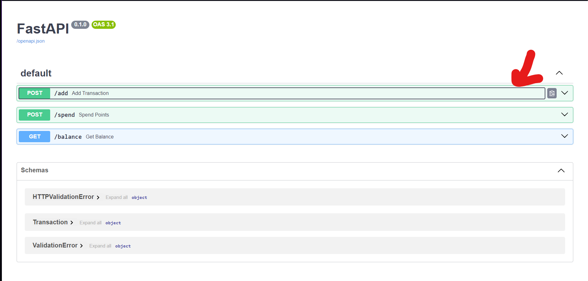
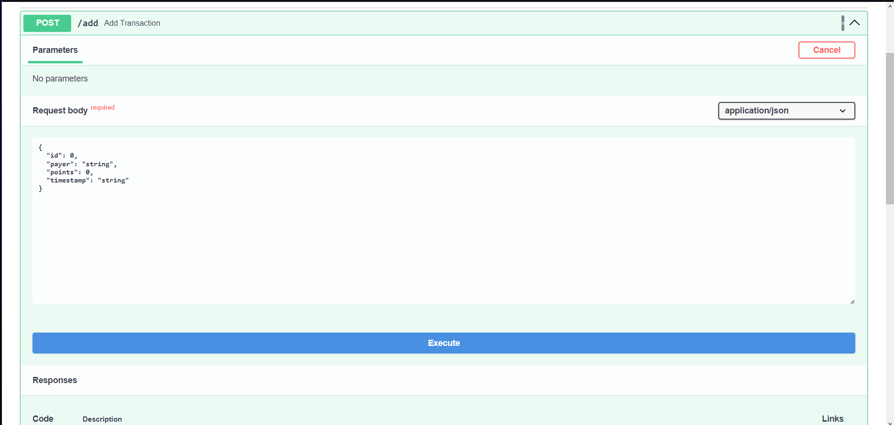
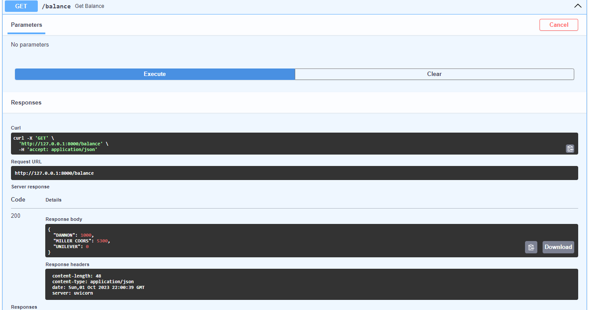

# Fetch BE Challenge

## Requirements

- Python 3.7+

## Getting Started

1. Install dependencies
```zsh
pip install -r requirements.txt
```
2. Start FastAPI process
```zsh
python main.py
```
3. Open local API docs [http://localhost:8000/docs](http://localhost:8000/docs)

## Notes

- The API is hosted at localhost:8000 with the following HTTP's methods:
    - GET: Get points the user has in their account based on the payer they were added through at "/balance"
    - POST: 
        - Add a new transaction to transaction history at "/add"
        - Update the payers' balance based on number of points user spent at "/spend"

- The documentation for the above HTTP's methods is hosted at localhost:8000/docs

- You can try sending the above requests by:
    1. Open local API docs [http://localhost:8000/docs](http://localhost:8000/docs)

    2. Click on the method you want to try 

    3. Click "Try it out" and insert your request body (if appear) 

    4. Click "Execute" and see the following output (status code, response body, etc.) 

## Copyright

The challenge was built by Khoa Cao, any reuse of the code should have Khoa's permission.